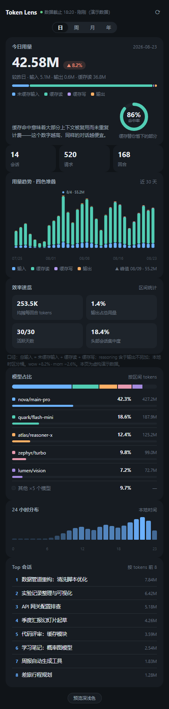
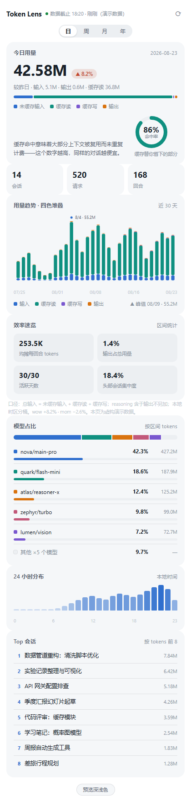
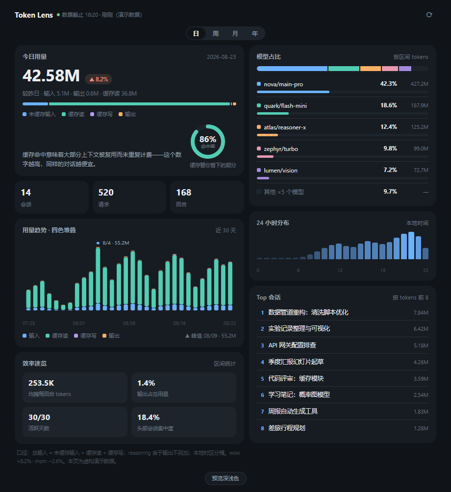

# Token Lens

[](../../releases)
[](./LICENSE)
[](#-installation)

**English** | [中文说明](#中文说明)

---

A token usage analytics panel for **DSH (DeepSeek Harness)** — living in your sidebar as a native tab, answering three questions at a glance: **how much did I burn? where did it go? how much did caching save me?**

嵌入 DSH Web GUI 的 token 用量统计面板：以 better-sidebar 标签页形态挂在右侧工具抽屉（与终端、浏览器并列），聚合**全部会话**的 token 流量，提供日 / 周 / 月 / 年四种粒度、按模型占比分解、缓存命中率与效率指标。

## ✨ Features

- **四粒度聚合**：日 / 周（ISO 周，周一零点）/ 月 / 年，全程统一本地时区
- **四桶口径**：未缓存输入 · 缓存读 · 缓存写 · 输出 分色堆叠趋势图，峰值桶自动标注
- **模型占比**：provider 别名归一（包装模型流量折算到真实出口），光谱胶囊条 + 目录式横条榜，长尾合并「其他」
- **缓存洞察**：命中率环形计量——「缓存替你省下的部分」
- **效率速览**：均摊每回合 tokens、输出占比、活跃天数、头部会话集中度
- **24 小时分布**：本地时热力条
- **Top 会话榜**：按 tokens 前 8，悬浮显示工作目录
- **agent 工具**：内置 `token_usage` 工具，在对话里直接查询任意时间段的文字版报告（本地渲染 markdown，零 token 成本）
- **体验细节**：localStorage 缓存优先（挂载即渲染旧数据 + 数据龄徽标）、骨架屏、错误重试、partial 有界披露、深浅色双主题自动跟随系统

## 📸 Screenshots

| 窄抽屉 · 深色 | 窄抽屉 · 浅色 |
|---|---|
|  |  |

宽态两列布局（面板拖宽后经容器查询自动切换）：



> 截图与演示均为**虚构示例数据**。想亲手玩：克隆仓库后用浏览器打开 [`docs/demo.html`](docs/demo.html)。

## 📦 Installation

### 方式 A · 从 Release 下载（推荐）

1. 到 [Releases](../../releases) 下载 `dsh-external-dsh-token-lens-x.y.z.tgz`
2. 在 DSH 中安装该插件包（插件市场本地包安装或 CLI `plugin_install`）

### 方式 B · super-injector 运行时注入（开发者）

已安装 [dsh-super-injector](https://www.npmjs.com/package/@dsh-external/dsh-super-injector) 时：

```
dev_build_plugin  <本仓库目录>
dev_inject_plugin <本仓库目录>
```

### 方式 C · 源码构建

```bash
npm install          # devDependencies: typescript / tsdown / @types/node
npm run build        # bash scripts/build.sh：tsc 编译 host 半边 → lib/index.js
npm run build:client # tsdown 打包 lib/client.js 单文件 bundle
npm run typecheck    # 全量类型检查
npm test             # node tests/smoke.mjs 冒烟自检（26 断言）
```

自包含构建：无需 DSH 源码 checkout；peers（@deepseek-ai/cordis、dsh-tools）从全局安装的 @deepseek-ai/dsh 包 junction 链接；脚本在 WSL bash 下会自愈转投 git-bash。

## 🚀 Usage

- **面板**：DSH Web GUI → 右侧工具抽屉 → 标签条「＋」→ **Token Lens**
- **工具调用**：对 agent 说「查一下本周 token 用量」，它会调用 `token_usage` 返回文字版报告

## 🔍 统计口径（认真声明）

Token 计数遵循公开契约，与上游 DeepTrace 对齐并修正其两处已知瑕疵：

| 项 | 口径 |
|---|---|
| 四桶互斥 | `inputTokens`（未缓存输入）/ `cacheReadTokens` / `cacheWriteTokens` / `outputTokens` |
| 总输入 | **= 未缓存输入 + 缓存读 + 缓存写**（上游漏计 cacheWrite，此处修正） |
| reasoning | 是 output 的子集，**不重复加总** |
| 防重计 | 只认 `assistant/message` 最终样本；`(turn, step)` last-wins；`seq < seedLength` 继承事件跳过（fork/resume 防双计） |
| 自排除 | 排除本插件自身目录产生的事件 |
| 时区 | **全程统一本地时区**：日=今天 0:00 起、周=本周一零点（ISO 周）、月=1 日零点、年=元旦（上游 presetRange 边界本地 / periodKey 与 stats 日键 UTC 三种口径混用，此处统一为一种） |
| live 会话 | 每次刷新重读、只进内存覆盖层不落盘（上游同款语义） |

## 🧮 HTTP API

前缀 `/token-lens/api`。全部 GET；信任门 = 仅回环 Host + 同源（跨站 403 / 参数非法 400）。

### GET /summary?granularity=day|week|month|year&limit=N&from&to

totals + buckets[]（含 modelTokens）+ stats{cacheHitRate, avgTokensPerTurn, peakDay, heat24, wow, mom} + topSessions + partial。

默认窗口：day=最近 30 天、week=最近 12 周、month=最近 12 月、year=最近 3 年（自然周期边界起算、含进行中的当期）。桶键为 periodKey 格式（本地时区版）：`day-YYYY-MM-DD` / `wk-YYYY-Www` / `mo-YYYY-MM` / `yr-YYYY`。`limit` 只裁剪桶数组；from/to 接受 ISO、`YYYY-MM-DD` 或纯数字 epoch。

### GET /models?from&to

模型占比降序 `{model, tokens{…}, share}`。

### GET /health

数据截止时间、会话数、新鲜度参数（不触发采集）。

## 🏗️ Architecture

```
DSH 会话存档（~/.dsh/sessions/*）
   │ ctx.sessionQuery.listSessions() → 并发 readSession()
   ▼
聚合引擎 src/engine.ts（纯函数零 IO）：本地时区「日 × 模型 × 四桶」明细 → rollup 四粒度
   ▼
增量缓存 src/store.ts + collect.ts
   ~/.dsh/storages/token-lens.json（原子写 + 结构版本 + 截止时间戳）
   TTL 10min 索引复用 · live 内存覆盖层 · 失败隔离 partial 披露 · 启动预热 + 单飞锁
   ▼
HTTP API src/api.ts ──► Web 面板 src/client/*（better-sidebar 标签页）
                    └─► agent 工具 token_usage（src/tool.ts）
```

## 🔒 Privacy & Security

- **数据不出本机**：统计全部在本机计算，无遥测无上报
- **回环信任门**：API 仅接受本机回环 Host 且非跨站请求（跨站 403 / 参数错 400）
- **仓库内容干净**：源码与文档不含任何真实用户统计数据；截图与演示页均为虚构数据（[`docs/demo.html`](docs/demo.html) 顶部有声明）

## 🙏 Credits

- [DeepTrace (dsh-whale-report)](https://www.npmjs.com/package/dsh-whale-report) —— 数据链路与聚合语义的参考实现；本项目在其公开契约上修正 cacheWrite 漏计与时区混用
- DSH & cordis 生态（@deepseek-ai/*）—— 宿主与插件运行时
- 本项目由多智能体流水线协作完成：调研 → 实现 → 独立验收 → 数值抽查误差为 0 🤖

## License

[BSD-3-Clause](./LICENSE)

---

## 中文说明

**Token Lens** 是 DSH（DeepSeek Harness）的 token 用量统计面板，以 better-sidebar 标签页形态嵌入右侧工具抽屉，聚合全部会话的 token 流量。

**功能一览**

- 日 / 周 / 月 / 年四种粒度聚合（ISO 周，全程本地时区）
- 未缓存输入 / 缓存读 / 缓存写 / 输出四桶堆叠趋势，峰值标注
- provider 归一后的模型占比（光谱胶囊条 + 横条榜）
- 缓存命中率环形计量、24 小时热力分布、Top 会话榜、效率速览
- 内置 `token_usage` agent 工具：对话中直接查询任意时间段报告

**安装**：从 [Releases](../../releases) 下载 tgz 安装；或克隆源码 `npm install && npm run build` 后注入。详见英文版 Installation。

**入口**：右侧工具抽屉标签条「＋」→ Token Lens；或在对话里让 agent 调用 `token_usage`。

**统计口径**：见上方「统计口径」表——四桶互斥、总输入含缓存写、reasoning 不加总、fork/resume 防双计、全程本地时区。

**隐私**：全本机计算、无遥测；HTTP API 有回环信任门；仓库内截图与演示页均为虚构数据。

**许可**：BSD-3-Clause
